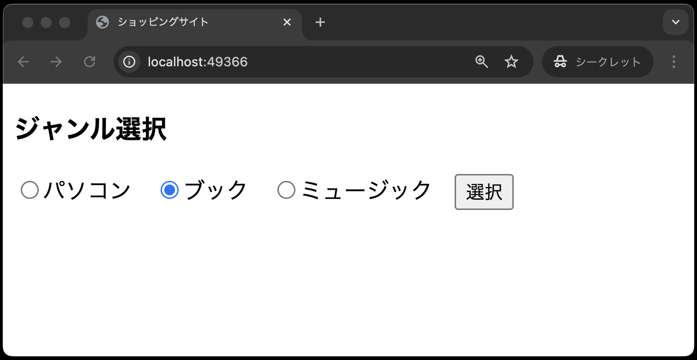
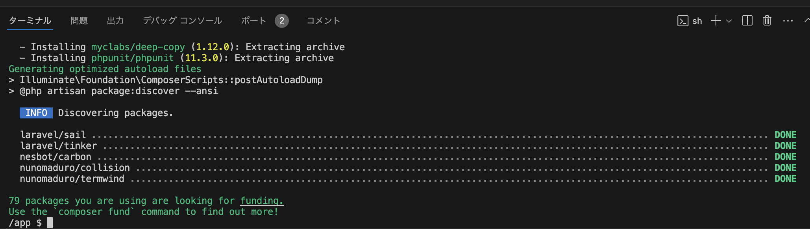
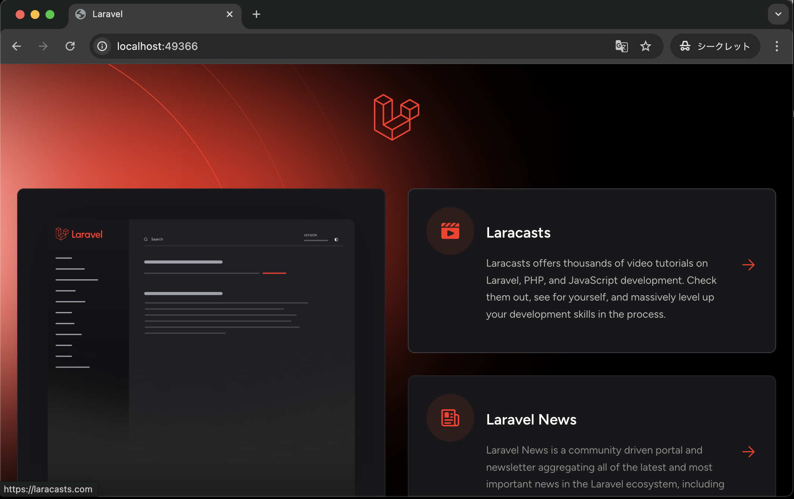

# 本章の狙い

- [ビュー、ルーティング](../shop_index/README.md)の章で学んだビューとルーティングの知識を定着させる
- ビューとルーティングを使って、ジャンル選択画面を再構築する

## 課題の説明

[ビュー、ルーティング](../shop_index/README.md)の章を参考に、以下の手順に従い、ジャンル選択画面を再構築してください。

## ジャンル選択画面の仕様

ここでは、ジャンル選択画面の仕様をおさらいします。 

- ジャンル選択画面は、ミニショップのトップページであり、商品のジャンルを選択する画面
- 画面上部には、ヘッダーが表示されており、ヘッダーには「ジャンル選択」と表示されている
- パソコン、ブック、ミュージックの3つのジャンルをラジオボタンで選択できる
- ブックにデフォルトでチェックが入っている

以上の仕様を満たすジャンル選択画面を以下の手順で作成してください。

## ①Laravel環境の構築

1. VSCode上で、`Ctrl+Shift+P`(Macの場合は`Cmd+Shift+P`)を押し、コンテナを起動する
2. VSCode上で、`Ctrl+J`(Macの場合は`Cmd+J`)を押し、ターミナルを表示する
3. ターミナルに`composer create-project laravel/laravel .` と入力し、`Enter`で実行する 
   
4. 30秒〜1分ぐらいして、以下のような表示がでれば、プロジェクトの作成完了となる(※2回目以降、コンテナを起動後に、上記コマンド`composer create-project laravel/laravel .`を実行する必要なし) 
   
5. 画面下部のポートから「web:80」の地球儀マークをクリックし、`http://localhost:{ポート番号}/`にブラウザでアクセスする 
   
6. 以下のような、画面が表示されればOK 
   

## ②ビューの作成

1. `resources/views` ディレクトリ内に、`index.blade.php` を作成する
2. コードを `index.blade.php` に記述する
   - コードは前期の[ミニショップ①(ジャンル選択画面、ジャンル別商品一覧画面)](https://2024web1.github.io/web_app_dev/ec-site-i/)を参考にし、[ビュー、ルーティング](../shop_index/README.md)の章で学んだ内容を反映させること
     - `<form>`タグの`action`属性は、ルーティング設定ができていないので、空欄(`action=""`)にする
     - ディレクティブ(`@`ではじまるやつ)の記載を忘れずに！

## ③ルーティングの設定

- [ビュー、ルーティング](../shop_index/README.md)の章を参考に、`routes/web.php` にルーティングを設定する

## 動作確認

- 以下のような画面が表示されればOK 
   