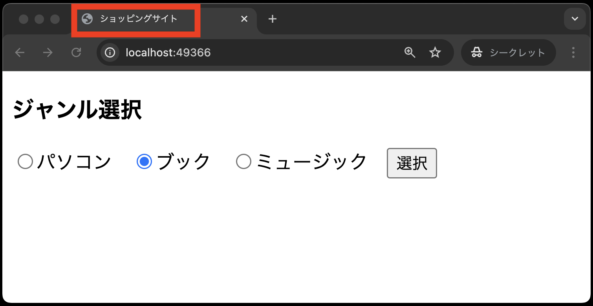

# 課題の提出について

提出した課題はGitHub上で自動採点されます。
従来通りGitHub上にpushすれば完了で、自動採点がはじまります。
ただし、**pushする前に以下の作業を事前に行わないと自動採点ができない**ので、以下の対応を忘れずに行ってください。

## .envファイルの修正(今回の課題のみ)

---

今回の課題ではデータベースの設定が必要ありませんが、GitHub上の自動採点のために`.env`ファイルに以下の内容を追加してください。
次回の課題からは、**データベースの設定を課題中に行っているため、この手順は不要** です。

なお、`.env`ファイルを修正すると、ブラウザ上ではジャンル選択画面の動作確認でエラーがでます。
ですので、`.env`ファイルの修正はブラウザでの動作確認後、**課題提出前に行ってください**。

1. `.env`ファイルの該当箇所を以下のように修正

      ```bash
      APP_NAME=Laravel
      APP_ENV=local
      APP_KEY=base64:UwGfTSBkd2fawCCiK1eBmOLhQKNF5Ll7Bk1QcKtwhSI=
      APP_DEBUG=true
      APP_TIMEZONE=UTC
      APP_URL=http://localhost

      # --- 途中省略 ---

      LOG_DEPRECATIONS_CHANNEL=null
      LOG_LEVEL=debug

      # --- 以下のように編集 ---
      DB_CONNECTION=mysql
      DB_HOST=db
      DB_PORT=3306
      DB_DATABASE=SAMPLE
      DB_USERNAME=sampleuser
      DB_PASSWORD=samplepass
      # --- ここまで ---

      # --- 以下省略 ---
      ```

## 課題の合格基準

以下を合格基準とします。

1. `http://localhost:{ポート番号}/`にアクセスすると、ジャンル選択画面が表示されること
2. タイトル(`<title></title>`)にショッピングサイトと表示されていること<br>
   

## 合格確認方法

1. 本課題の[課題ページ](https://classroom.github.com/a/9Lg0o5zS)に再度アクセスする
2. 画面上部にある`Actions`をクリックする<br>

3. **一番上**の行に、緑色のチェックが入っていればOK<br>
